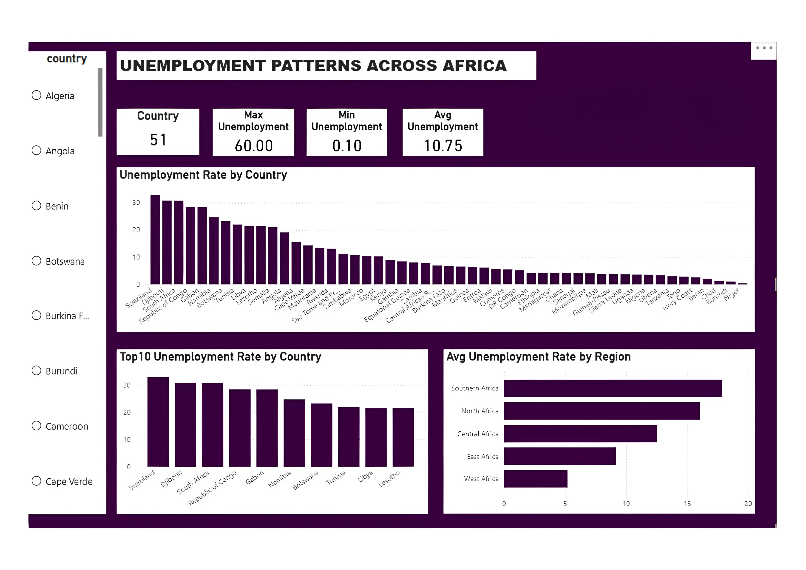
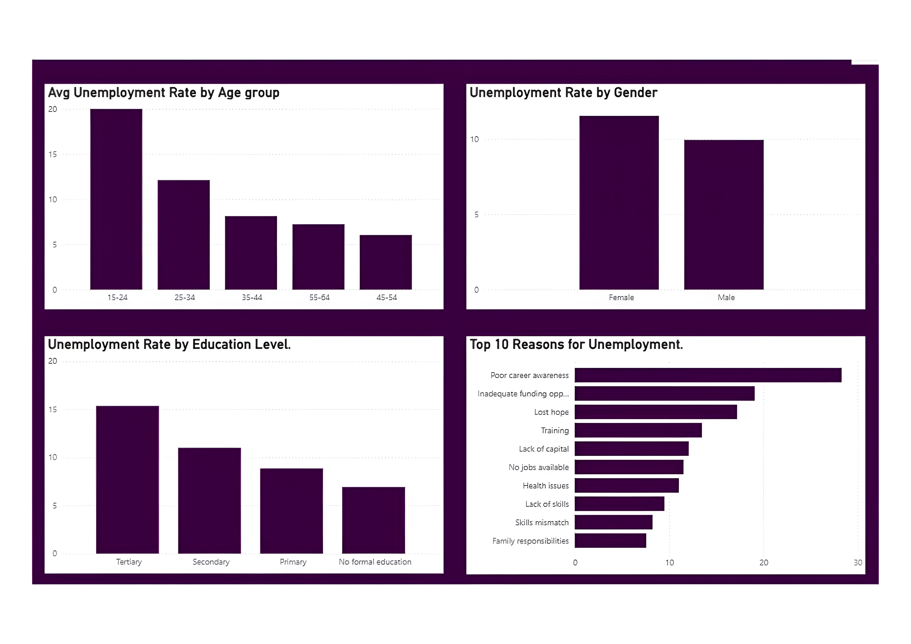
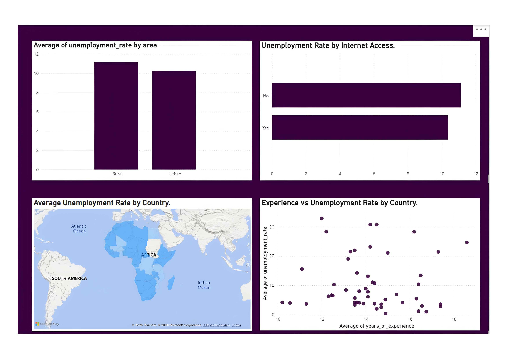

# AI-Driven Skills Gap Analysis: Understanding Unemployment in Africa

<div align="center">



[](https://app.powerbi.com/view?r=eyJrIjoiNjczMDg5ZDAtNjRkNC00ODE5LTk0YTgtZDJmOGExNmJjYjA3IiwidCI6IjIyNjgyN2Q2LWE5ZDAtNDcwZC04YzE1LWIxNDZiMDE5MmQ1MSIsImMiOjh9)
[](https://philipgloria.github.io/InsightHer_Africa_Unemployment_Analysis/)

**InsightHer** · Women Techster Bootcamp 5.0  
*A merge of Data Analysis and Technical Project Management Learning Track*

</div>

---

## 📌 Table of Contents

- [Problem Statement](#-problem-statement)
- [Project Objectives](#-project-objectives)
- [SDG Alignment](#-sdg-alignment)
- [Data Sources](#-data-sources)
- [AI Component](#-ai-component)
- [Dashboard Preview](#-dashboard-preview)
- [Key Findings](#-key-findings)
- [Project Structure](#-project-structure)
- [Team & Duty Allocation](#-team--duty-allocation)
- [Getting Started](#-getting-started)
- [Live Links](#-live-links)

---

## 📋 Problem Statement

Unemployment remains one of the most pressing socio-economic challenges across Africa, particularly among young people and recent graduates. While many individuals possess formal education, employers often report difficulties finding candidates with the specific skills required in the labour market.

This mismatch between available skills and industry demand creates a **skills gap**, which contributes to persistent unemployment. This project analyzes labour market data across 51 African countries to identify demanded skills, uncover patterns, and provide actionable insights to help address the crisis.

---

## 🎯 Project Objectives

- 📊 Analyze unemployment trends across African countries and regions
- 🏭 Identify industries with the highest employment demand
- 🔍 Determine the most in-demand skills in the labour market
- ⚖️ Identify gaps between workforce skills and employer demand
- 🤖 Use AI tools to extract patterns and insights from labour market data

---

## 🌐 SDG Alignment

This project aligns with **UN Sustainable Development Goal 8**:

> **Decent Work and Economic Growth** — Promoting productive employment and sustainable economic opportunities for all.

---

## 🗂️ Data Sources

| Source | Description |
|---|---|
| Statistics South Africa | Labour force and unemployment data |
| World Bank | Employment statistics |
| Kaggle | Datasets related to job skills and employment |
| Online Job Listings | Datasets highlighting skills required by employers |

---

## 🤖 AI Component

AI tools are integrated to enhance the depth of analysis:

- **Skill Extraction** — Analyze job descriptions and extract commonly required skills
- **Pattern Recognition** — Identify trends and patterns in labour market data
- **Insight Generation** — Highlight the most demanded skills and emerging opportunities

---

## 📊 Dashboard Preview

### Overview — Unemployment Patterns Across Africa


> 51 countries analyzed · Max unemployment: **60.00%** · Min: **0.10%** · Avg: **10.75%**
> Southern Africa records the highest regional average unemployment rate.

---

### Demographics — Age, Gender & Education



> Youth aged **15–24** face the highest unemployment rates.  
> Female unemployment is marginally higher than male across the continent.  
> Workers with **Tertiary education** face a higher unemployment rate — reflecting the skills mismatch.  
> Top reason for unemployment: **Poor career awareness**, followed by inadequate funding opportunities and lost hope.

---

### Geographic & Access Insights



> Rural areas report slightly higher unemployment than urban areas.  
> Limited internet access is associated with higher unemployment rates.  
> A negative correlation exists between years of experience and unemployment rate across countries.

---

## 🔑 Key Findings

- **51 African countries** were analyzed with an average unemployment rate of **10.75%**
- **Swaziland, Djibouti, and South Africa** rank in the top 3 highest unemployment rates
- **Southern Africa** has the highest regional average unemployment (~18%), while **West Africa** has the lowest
- The **15–24 age group** is the most affected demographic
- **Poor career awareness** is the leading self-reported reason for unemployment
- Workers with **no internet access** face higher unemployment rates, highlighting the digital divide
- A skills mismatch exists — tertiary-educated individuals still face significant unemployment

---

## 📁 Project Structure
```
📦 InsightHer_Africa_Unemployment_Analysis/
├── 📂 datasets/
│   └── african_unemployment_dataset.xlsx, etc
├── 📂 images/
│   ├── dashboard_overview.jpg
│   ├── dashboard_demographics.jpg
│   └── dashboard_geographic.jpg
├── 📂 report/
│   └── africa_labour_dashboard.html
├── 📂 presentation/
│   └── africa_labour_presentation.pptx
├── 📂 docs/
│   └── Unemployment_Africa_Report_Short.docx
└── README.md, etc...
```

---

## 👥 Team & Duty Allocation

**Team Name:** InsightHer  
**Programme:** Women Techster Bootcamp 5.0 — Data Analysis & Technical Project Management Learning Track

| Role | Responsibility | Key Tasks |
|---|---|---|
| 🧭 **Group Representative** | Coordinate project & ensure progress | Organize meetings, assign tasks, manage deadlines, liaise with mentors, compile contributions |
| 📥 **Data Collection Group** | Gather all datasets | Source unemployment & labour market datasets, organize shared folders |
| 🧹 **Data Cleaning & Preparation Group** | Prepare datasets for analysis | Remove duplicates, handle missing data, standardize columns, merge datasets |
| 📈 **Data Analysis Group** | Analyze data & generate insights | Analyze trends, identify industries, compare workforce skills vs employer demand |
| 🤖 **AI Integration Group** | Implement the AI component | Use AI tools to analyze job descriptions, extract skills, identify trends |
| 📊 **Data Visualization & Dashboard Group** | Create visual representations | Build Power BI dashboard, create charts for trends, industry demand, skills gap |
| 📝 **Documentation Group (Secretaries)** | Compile and finalize full report | Combine sections, edit and format, proofread document |
| 🎤 **Presentation Group (All Members)** | Prepare and deliver Demo Day presentation | Design slides, summarize findings, assign speakers, rehearse |

---

### 🗂️ File Management & Version Control

**GitHub File Management** is handled by **Philip Toluwalope Gloria**

---

## 🚀 Getting Started

1. **Clone the repository**
```bash
   git clone https://github.com/philipgloria/InsightHer_Africa_Unemployment_Analysis.git
   cd InsightHer_Africa_Unemployment_Analysis
```

2. **Explore the datasets**
```
   datasets/
```

3. **View the HTML report**
   Open `report/africa_labour_dashboard.html` in your browser.

4. **Access the live Power BI dashboard** via the badge link at the top of this README.

---

## 🔗 Live Links

| Resource | Link |
|---|---|
| 📊 Power BI Live Dashboard | [Click to View](https://app.powerbi.com/view?r=eyJrIjoiNjczMDg5ZDAtNjRkNC00ODE5LTk0YTgtZDJmOGExNmJjYjA3IiwidCI6IjIyNjgyN2Q2LWE5ZDAtNDcwZC04YzE1LWIxNDZiMDE5MmQ1MSIsImMiOjh9) |
| 🌐 HTML Report | [Unemployment Africa Report](https://philipgloria.github.io/InsightHer_Africa_Unemployment_Analysis/) |

---

<div align="center">

Made with ❤️ by **InsightHer** · Women Techster Bootcamp 5.0

</div>
